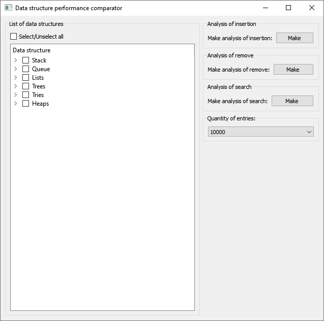
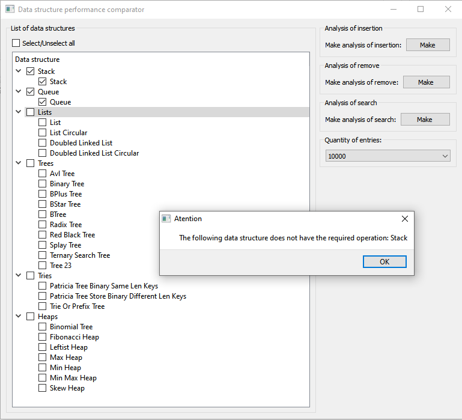

Data Structure Performance Comparator
====================

This repository has a project with the implementation of a Data Structure Performance Comparator.

It is written in C++.

It has several data structures that are compared, considering insertion, remove and search.

All of the data structures are written in C++ and are independent of platform. Each one is fully tested,
using unit tests. The library used to make the Unit Test is the Catch v2.12.3.
The code is already in this repository.

Each library is in this github account. They are already configured as submodules. Once you clone this repo,
you must execute the following command:

git submodule update --init --recursive

This project uses the gnuplot, to generate graphs. Install this tool in your computer before use this software.

- - -

Sample images: 
====================

## Main gui:

## Main gui with data structures categories expanded:

## You can select which data structures you want to compare.

## This is the gui, when the user selects the desired structures and clicks in make test of insertion.

## If some data structure is not able of execute such function, a message is shown. For instance: the stack data structure does not have the search operation.

## This is a image of the comparisson of insert

